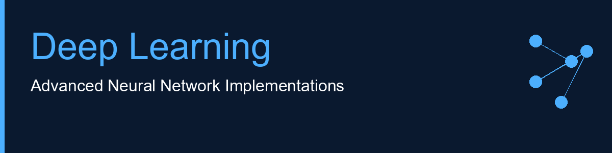

<p align="center">
  
</p>

# Deep Learning Projects

A collection of deep learning projects showcasing neural networks, NLP, and advanced AI techniques.

## 📁 Current Projects

### 1. **Advanced RAG Pipeline with Reranking**
Retrieval-augmented generation system with semantic reranking using CrossEncoder and Groq API.

### 2. **Neural Networks**
Implementations of AlexNet, CNN, FNN, RNN, and LSTM architectures with datasets (CIFAR-10, MNIST).

### 3. **RNN-LSTM Sentiment Analyzer**
Full-stack web app for sentiment analysis with Flask backend, HTML/JS frontend, and dual model comparison.

---

## 🚀 Quick Start

### Installation
```bash
git clone <repository-url>
cd Deep-Learning
pip install tensorflow keras numpy scikit-learn flask flask-cors sentence-transformers groq
```

### Running Projects

**RAG Pipeline:**
```bash
cd Advanced-RAG-Pipeline-with-Reranking && python main.py
```

**Neural Networks:**
```bash
cd Neural-Networks && jupyter notebook
```

**Sentiment Analyzer:**
```bash
cd RNN-LSTM-Sentiment-Analyzer/backend && python app.py
# Then open frontend/index.html in browser
```

---

## 📝 Key Features

✅ **Multiple architectures** - CNN, RNN, LSTM, FNN  
✅ **Full-stack application** - Backend API + frontend interface  
✅ **Advanced NLP** - RAG with semantic reranking  
✅ **Pre-trained models** - Ready-to-use weights  
✅ **Jupyter & Python** - Both formats available  

---

## 🚧 Coming Soon

More projects are in development:
- **Transformer Models** - BERT, GPT implementations
- **Computer Vision** - Object detection, image segmentation
- **Time Series** - ARIMA, Prophet forecasting
- **Generative Models** - VAE, GAN architectures
- **Reinforcement Learning** - Q-Learning, Policy Gradient
- **And much more...**

Stay tuned! 🎯

---

## 📄 License

MIT License - Open source

**Last Updated:** May 2026
